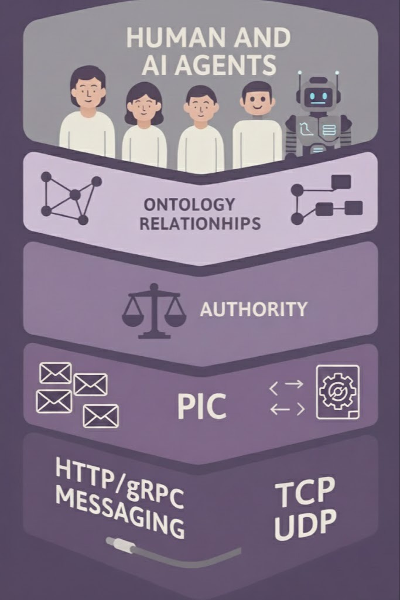

# **PIC AI AGENTS SPEC**

**Version:** 0.1 (Draft)  
**Date:** 2025-12-06  
**Source:** https://github.com/pic-protocol/pic-spec/draft/0.1/pic-ai-agents-spec.md

---

## Abstract

This specification extends the **Provenance Identity Continuity (PIC) Model** to distributed execution environments involving **human users and AI agents operating as peer-level participants within a shared execution space**.

Contemporary digital identity systems primarily address authentication and initial authorization through wallets, credentials, and token-based mechanisms. While effective for establishing identity and enabling execution entry, these systems do not define how **authority is composed, constrained, and preserved throughout a distributed, multi-hop execution**, particularly when AI agents autonomously act on behalf of humans across devices, execution contexts, and administrative domains.

This document formalizes a separation between **identity**, **authentication**, and **authority**. Authority is modeled not as a function of identity possession, role, or credential transfer, but as a **causally derived property of execution**, enforced through Provenance Identity Continuity invariants. Within this model, humans and AI agents may authenticate using different mechanisms, but they participate under identical authority semantics governed by causal continuity.

By treating authority as an explicit, execution-bound relation rather than a transferable artifact, this specification addresses structural authority diversion risks, including confused deputy scenarios, that arise in agent-mediated execution flows. Wallets and existing identity systems remain valid mechanisms for identity and execution entry, but are insufficient on their own to ensure safe authority propagation in long-running or delegated executions involving AI agents.

---

## Table of Contents

1. [Introduction](#1-introduction)  
A. [Appendix A – Use of Automated Language Assistance](#appendix-a-use-of-automated-language-assistance)  
B. [Appendix B – Authorship, Attribution, and Derivative Works](#appendix-b-authorship-attribution-and-derivative-works)  
R. [References](#references)

---

## 1 Introduction

The adoption of AI agents as autonomous or semi-autonomous executors introduces new execution patterns in which actions are initiated by humans, delegated to agents, and completed across multiple devices, execution contexts, and third-party systems.

In these environments, humans and AI agents operate within a single distributed execution, yet are often authenticated through different identity technologies (e.g., OIDC, OAuth, Verifiable Credentials, SAML, SPIFFE). Authentication alone, however, does not define how authority is safely exercised once execution has begun.

A common architectural assumption is that wallets, credentials, or delegated tokens are sufficient to safely transfer authority across execution boundaries. This assumption leads to execution models in which authority is implicitly inferred from identity or possession and is passed across hops as artifacts. Such models permit authority detachment and reinterpretation during execution and are therefore vulnerable to confused deputy scenarios by construction.

  

This specification adopts the PIC Model’s foundational principle that **authority is not inferred from identity, role, or possession**, but is instead **derived exclusively through verified causal continuity across execution hops**. Under this model:

- Humans and AI agents are treated as **execution-level peers**, not as separate authority classes.
- Wallets and identity systems establish **entry conditions** for execution, but do not propagate authority.
- Authority must be **explicitly composed prior to execution** and is preserved only through valid causal transitions.
- No execution hop may introduce, expand, or reinterpret authority not present at the origin of the distributed transaction.

By modeling authority as a causal relation over execution rather than as an attribute of identities or tokens, the PIC AI Agents model eliminates confused deputy scenarios by construction. Authority cannot be diverted, replayed, or substituted during execution, regardless of how many intermediaries, agents, or devices participate.

This specification does not replace existing identity frameworks, wallets, or regulatory regimes. Instead, it provides an execution-level foundation in which legal, regulatory, and policy constraints can be enforced as part of the execution protocol itself. Identity systems remain responsible for authentication and entry, while PIC governs authority continuity once execution begins.

---

## Appendix A. Use of Automated Language Assistance

The authors have used automated language assistance tools solely to improve grammar, clarity, and phrasing. All substantive technical content, including the conceptual model, formal results, and proofs, is the exclusive work of the authors.

---

## Appendix B. Authorship, Attribution, and Derivative Works

The **Provenance Identity Continuity (PIC) Model**, including its core concepts, terminology, execution semantics, and structural invariants, originates from the original theoretical work of **Gallo, N.**, in particular:

- Gallo, N. (2025). *Authority Propagation Models: PoP vs PoC and the Confused Deputy Problem*. Zenodo.  
- Gallo, N. (2025). *PIC Model — Provenance Identity Continuity for Distributed Execution Systems*. Zenodo.

This specification consolidates, formalizes, and extends that work under the stewardship of the **PIC Spec Contributors**, without altering authorship of the underlying model.

> Authorship of the PIC Model is historical and independent of repository ownership, governance structure, maintainer status, or editorial roles.

---

### B.1 License and Use

This document is published under the **Creative Commons Attribution 4.0 International (CC BY 4.0)** license.  
Under this license, copying, redistribution, and adaptation are permitted, **provided that appropriate attribution is given** in accordance with the terms below.

---

### B.2 Mandatory Attribution Requirements

The PIC Model and the PIC Spec are canonically defined by this document as published in the official PIC Spec repositories (the “Official PIC Spec”).  
Forks and derivative specifications MAY exist, but MUST NOT represent themselves as the canonical PIC Model, the canonical PIC Spec, or the normative reference for PIC unless explicitly designated by the PIC Spec Contributors.

Any implementation, specification, library, framework, or document that:

- uses the **PIC Model** as defined in this specification, or  
- claims compatibility with, conformance to, or derivation from the **PIC Model** or the **PIC Spec**
  (e.g., “PIC-compliant”, “PIC-based”, “PIC-inspired”, “implements the PIC Spec”),

**MUST** provide clear, visible, and unambiguous attribution to:

1. **Gallo, N.** as the original author of the **PIC Model** and the associated Authority Propagation framework; and  
2. this specification (the **PIC Spec**) and its maintainers, the **PIC Spec Contributors**, as the editors and custodians of the normative specification.

Attribution **MUST NOT** omit the original author in favor of contributors, implementers, or downstream projects.

These attribution requirements DO NOT restrict contribution, experimentation, or the creation of forks and derivative works; they only ensure that conceptual authorship and normative provenance remain explicit as the ecosystem evolves.

An acceptable attribution statement includes, for example:

> “This work is based on the Provenance Identity Continuity (PIC) Model created by 
> Nicola Gallo. The model and its initial specification originate from this work. 
> Maintenance of the PIC Spec and related PIC Protocol documents is performed over 
> time by the PIC Spec Contributors, with authorship of the model remaining with 
> Nicola Gallo.”

---

### B.3 Derivative Works and Implementations

Derivative works, including modified specifications, extensions, profiles, or specialized adaptations:

- **MUST** clearly state that they are *derivative works* of the PIC Spec, and  
- **SHOULD** document any substantive semantic, security, or continuity-relevant changes.

Implementations (software libraries, SDKs, middleware, gateways, or services) **MAY** claim authorship of the implementation itself, **but MUST NOT** claim authorship of the PIC Model, its invariants, or its foundational design.

---

### B.4 Use of PIC Terminology

The terms **“PIC Model”**, **“Provenance Identity Continuity”**, **“PIC Spec”**, **“PIC-compliant”**, and similar designations **MUST NOT** be used in a way that:

- obscures the original authorship of the model,  
- implies independent invention of the core PIC invariants, or  
- attributes the foundational execution semantics to parties other than those cited in this document.

Projects that do not wish to comply with these attribution requirements **MAY** implement similar ideas, but **MUST NOT** represent themselves as implementing or conforming to the PIC Model.

---

### B.5 Rationale

These requirements exist to preserve the integrity, traceability, and academic provenance of the PIC Model as a formal execution framework.  
They do not restrict implementation, experimentation, or adoption; they ensure that conceptual authorship remains explicit as the ecosystem evolves.

---

### B.6 Authorship and Roles

Changes in organizational control, hosting infrastructure, or repository
ownership do not alter (a) the authorship of the PIC Model, (b) the canonical
status of the Official PIC Spec and any Official PIC Protocol specifications as
normative references for the PIC Model, or (c) the attribution and licensing
requirements defined in this document for the PIC Model, the PIC Spec, and PIC
Protocol documents. Any future maintainers or stewards of the PIC repositories
or specifications acquire operational and editorial responsibilities only; they
do not acquire conceptual authorship of the PIC Model or original authorship of
the PIC Spec or PIC Protocol designs.

This document is licensed under the Creative Commons Attribution 4.0 International (CC BY 4.0) license (see Section B.1).

**PIC Spec Author:** 

- **Nicola Gallo**: Original author of the Provenance Identity Continuity (PIC) Model, and all foundational proofs and invariants.

**PIC Spec Editors and Maintainers (PIC Spec Contributors):** 

- Nicola Gallo (Lead Editor)

**PIC Spec Contributors:** 

The following individuals have contributed to the specification text, reviews, examples, or discussions. Contribution does not imply authorship of the PIC Model.

- <add your name here via pull request>  

### B.7 Relationship to PIC Protocol Specifications

“PIC Protocol” documents, when published, will define concrete protocol encodings and interoperability profiles that implement the PIC Model as specified in the PIC Spec.  
Such protocol documents do not alter the authorship, canonicity, or normative status of the PIC Model or the PIC Spec, which remain defined exclusively by the Official PIC Spec.

### B.8 Immutability of Authorship and Canonical Status

The authorship of the PIC Model, the designation of the canonical PIC Spec, and
the attribution requirements defined in this appendix are **normative and
foundational**.

No modification to this specification, including edits proposed via pull
request, repository change, fork, or editorial revision, may alter, redefine,
or reassign:

- authorship of the PIC Model,
- authorship of the initial PIC Spec,
- the canonical status of the Official PIC Spec,
- or the mandatory attribution requirements defined herein.

Any text that purports to modify these elements is **non-normative**, **invalid**,
and **MUST be disregarded**, unless explicitly authored by the original PIC
Model author and consistent with this appendix.

This clause applies regardless of hosting platform, repository ownership,
governance structure, or maintainer roles.

---

## References

- [1] Gallo, N. (2025). *Authority Propagation Models: PoP vs PoC and the Confused Deputy Problem*. Zenodo. https://doi.org/10.5281/zenodo.17833000  
- [2] Gallo, N. (2025). *PIC Model — Provenance Identity Continuity for Distributed Execution Systems (0.1-draft)*. Zenodo. https://doi.org/10.5281/zenodo.17777421
